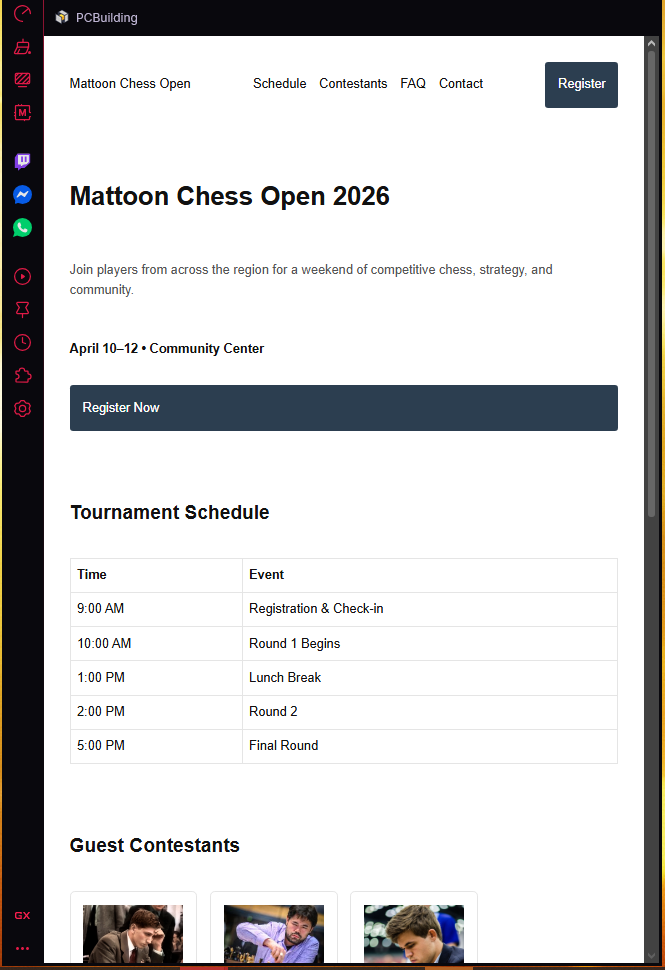
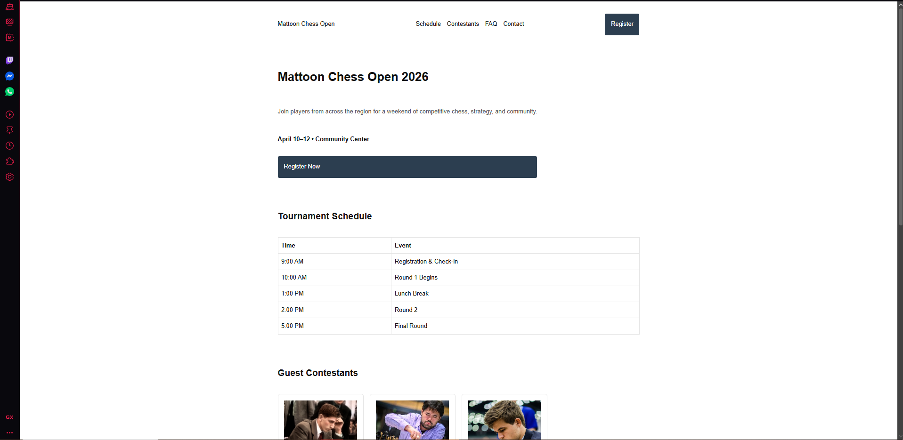

# Chess Event Landing Page

## Project Overview
This project recreates an event landing page layout using modern CSS layout techniques. The page represents a fictional **City Chess Open** tournament and includes information about the event schedule, guest contestants, and frequently asked questions.

The goal of this project was to practice **Flexbox, CSS Grid, and mobile-first responsive design** while maintaining consistent spacing and typography using a simple design system.

---

## Layout Sections
The page contains the following sections:

- Navbar
- Hero section with event title and register button
- Tournament schedule table
- Guest contestants grid
- FAQ section
- Footer

---

## Technologies Used

- HTML5
- CSS3
- Flexbox
- CSS Grid
- Mobile-first responsive design
- CSS variables for design system

---

## Layout Techniques

- **Flexbox** is used to create the navigation bar layout.
- **CSS Grid** is used for the guest contestants card section.
- A **mobile-first approach** was used with a responsive breakpoint at `768px`.

---

## Design System

The site uses a simple design system including:

- CSS variables in `:root`
- A spacing scale for consistent margins and padding
- A type scale for headings and body text
- Utility classes such as `.container`, `.stack`, and `.muted`

---

## Live Site

GitHub Pages link:

[https://your-github-pages-link-here](https://ethyates.github.io/Chess-Event-Landing/)

---

## Repository

GitHub repository link:

[https://github.com/Ethyates/Chess-Event-Landing/](https://github.com/Ethyates/Chess-Event-Landing)

---

## Screenshots

### Mobile Layout

### Desktop Layout

